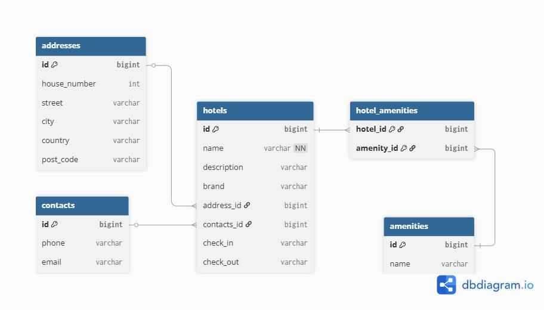

# 🏨 HotelInfo
## Приложение для работы с отелями

**HotelInfo** — это платформа, которая помогает управлять данными об отелях, 
предоставляя удобный REST API для создания, поиска, фильтрации и анализа информации.

### Используемые технологии: Java 21, Spring Boot, Hibernate, Spring Data JPA, H2, Maven.

# 🔐 Реализованный функционал
- получение списка всех отелей с их краткой информацией
- получение расширенной информации по конкретному отелю
- поиск получение списка всех отелей с их краткой информацией по параметрам: name, brand, city, country, amenities
- создание нового отеля
- добавление списка amenities к отелю
- получение количества отелей сгруппированных по каждому значению указанного параметра

# Схема базы данных hoteldb

## Особенности схемы:
1. **Hotel** — центральная сущность, связанная со всеми другими
2. **Address, Contacts** — детализированные вложенные объекты 
3. **HotelAmenities** — связь многие-ко-многим между отелями и удобствами
